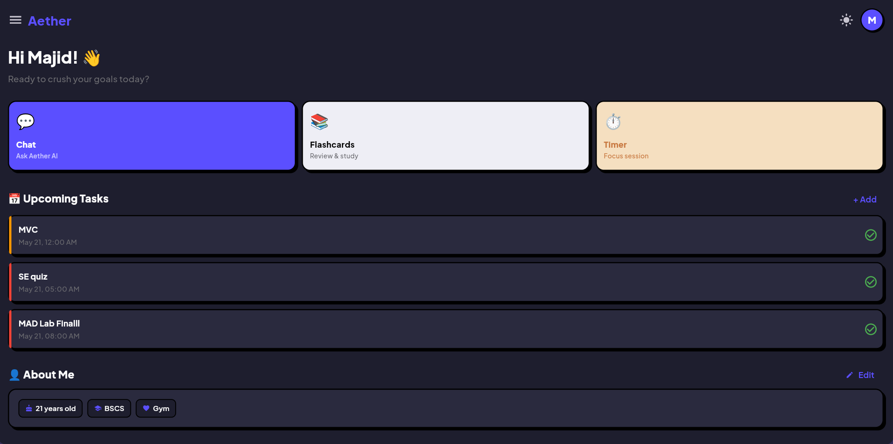
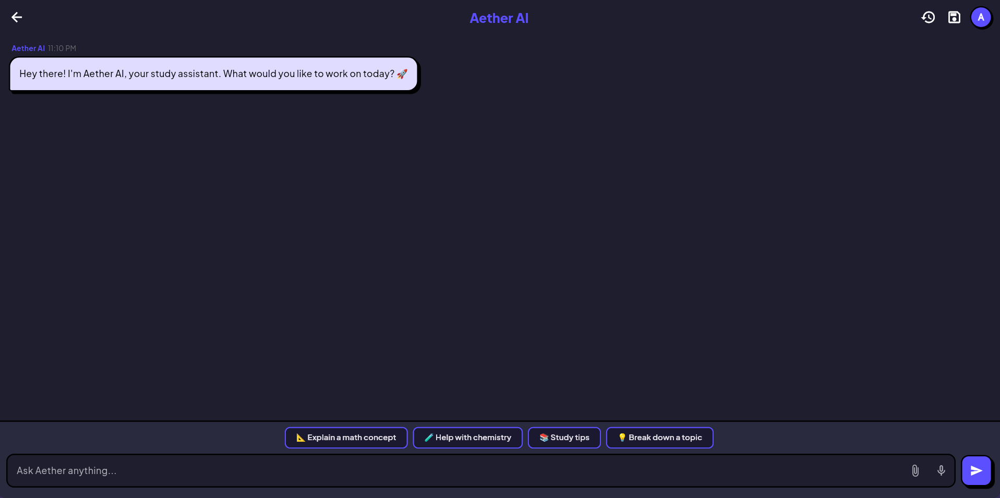
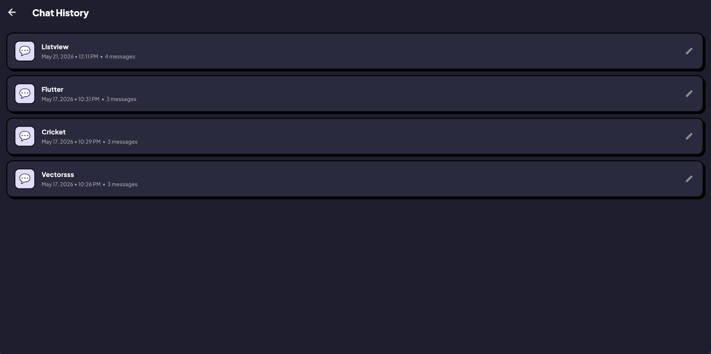
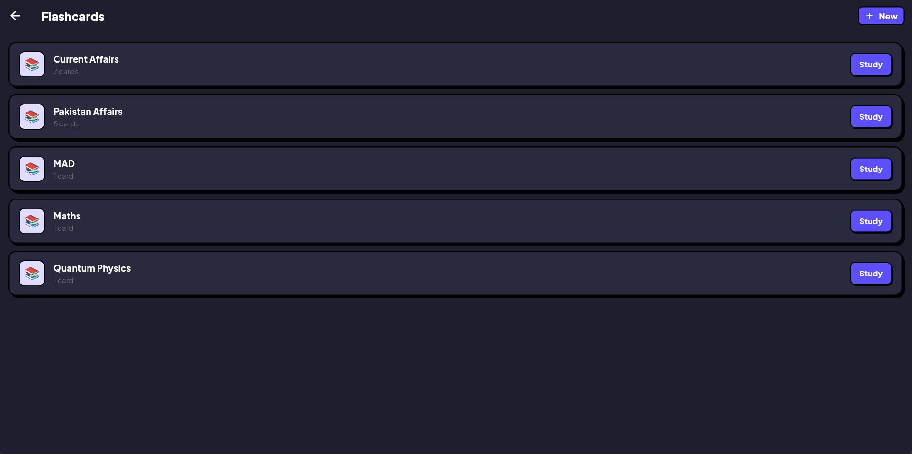
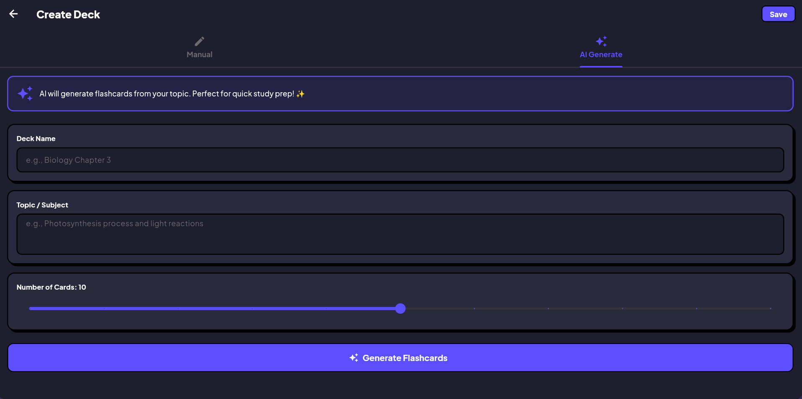
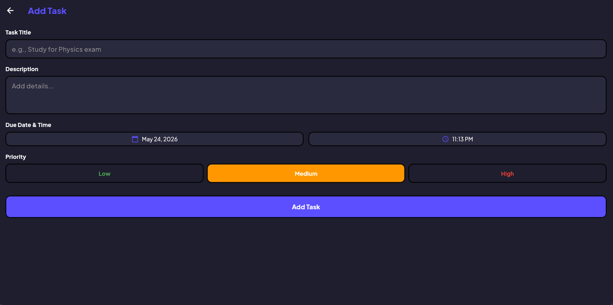
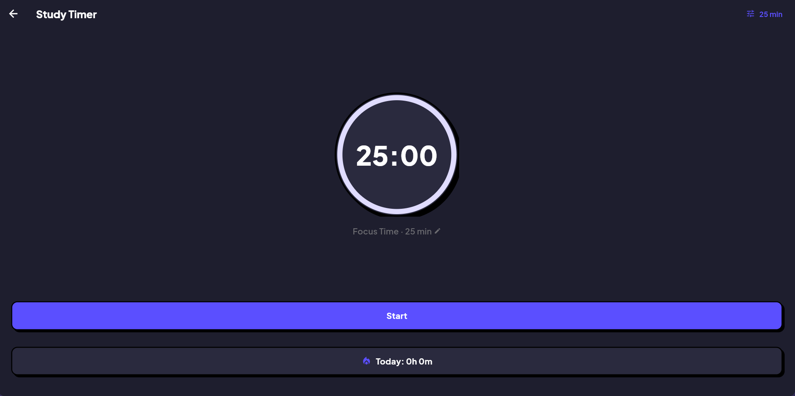
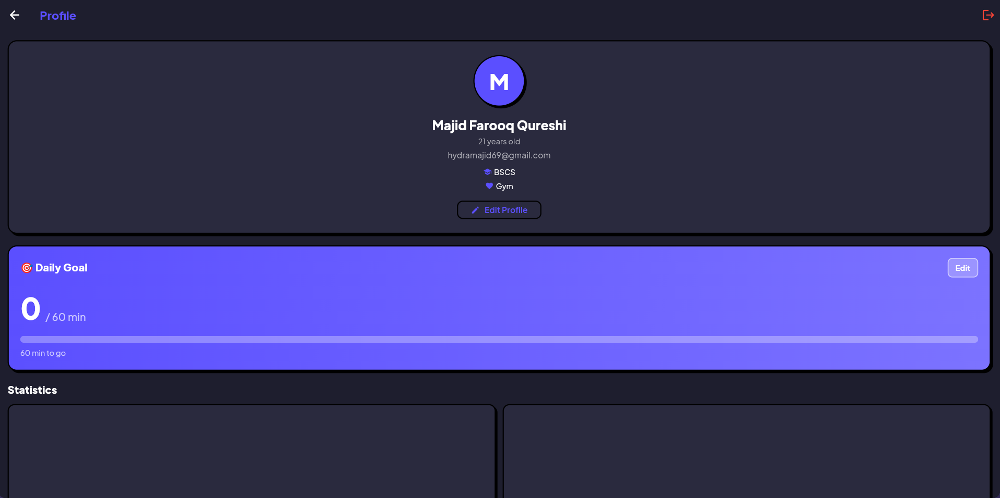

# 🌟 Aether - Your AI-Powered Study Companion

<div align="center">


**Study smarter, not harder** ✨

[Features](#-features) • [Screenshots](#-screenshots) • [Tech Stack](#-tech-stack) • [Setup](#-quick-start) • [Demo](#-demo)

</div>

---

## 🎯 What is Aether?

Aether is a **next-generation study assistant** that combines the power of AI with essential productivity tools. Built with Flutter and Firebase, it's your all-in-one platform for acing exams, staying organized, and learning efficiently.

> 💡 **Fun Fact:** "Aether" means the pure essence that the gods breathe in Greek mythology. We believe learning should feel that effortless!

---

## ✨ Features

### 🤖 AI Study Tutor
- **Personalized Learning**: AI that acts like a real tutor, not just a chatbot
- **Conversation Memory**: Remembers your entire conversation for context-aware help
- **Smart Suggestions**: Quick-start prompts for math, chemistry, study tips, and more
- **Teaching Style**: Guides you to answers instead of just giving them away

### 🎴 AI Flashcard Generator
- **Instant Creation**: Generate 5-15 flashcards from any topic in seconds
- **Smart Questions**: AI creates understanding-based questions, not just facts
- **Manual Mode**: Full control with traditional card-by-card creation
- **Study Ready**: Save and study immediately

### ✅ Smart To-Do List
- **Priority Levels**: Color-coded tasks (low, medium, high)
- **Due Dates**: Never miss a deadline with date/time reminders
- **Real-time Sync**: Tasks update instantly across devices
- **Quick View**: See your top 3 upcoming tasks on the home screen

### ⏱️ Focus Timer
- **Customizable Sessions**: 1-120 minutes (default: 25 min Pomodoro)
- **Progress Tracking**: All study sessions saved to your profile
- **Daily Goals**: Set and track daily study time targets
- **Visual Progress**: Circular timer with smooth animations

### 📚 Flashcard System
- **Create Decks**: Manual or AI-generated flashcards
- **Study Mode**: Flip cards, mark as learned, track progress
- **Score Tracking**: See how many cards you got right
- **Organized**: All decks in one place with card counts

### 👤 Profile & Stats
- **Study Analytics**: Total study time, completed tasks, decks created
- **Daily Goals**: Set and track daily study targets with progress bars
- **Personal Info**: Add bio, education, hobbies, and more
- **About Me Card**: Showcase your profile on the home screen

### 🎨 Beautiful Design
- **Neo-Brutalist UI**: Bold borders, vibrant colors, modern aesthetics
- **Dark Mode**: Easy on the eyes for late-night study sessions
- **Smooth Animations**: Polished transitions and loading states
- **Responsive**: Works on Android, Web, and more

### 🔐 Secure Authentication
- **Email/Password**: Traditional sign-up with strict validation
- **Google Sign-In**: One-tap authentication
- **Password Reset**: Easy recovery via email
- **Persistent Sessions**: Stay logged in across app restarts

---

## 📱 Screenshots

<div align="center">

### Home & Chat
| Home Screen | AI Chat | Chat History |
|-------------|---------|--------------|
|  |  |  |

### Flashcards & Productivity
| Deck List | AI Generate | Tasks |
|-----------|-------------|-------|
|  |  |  |

### Timer & Profile
| Focus Timer | Profile |
|-------------|---------|
|  |  |

</div>

---

## 🛠️ Tech Stack

### Frontend
- **Flutter 3.0+** - Cross-platform UI framework
- **Dart** - Programming language
- **Provider** - State management
- **Google Fonts** - Plus Jakarta Sans typography

### Backend & Services
- **Firebase Auth** - User authentication (Email + Google)
- **Cloud Firestore** - Real-time NoSQL database
- **Groq API** - AI chat & flashcard generation (llama-3.3-70b)

### Architecture
- **Clean Architecture** - Separation of concerns
- **Repository Pattern** - Data abstraction
- **Provider Pattern** - State management
- **Service Layer** - API integrations

### Key Packages
```yaml
firebase_core: ^3.10.0
firebase_auth: ^5.3.4
cloud_firestore: ^5.5.2
google_sign_in: ^6.2.2
http: ^1.2.2
flutter_dotenv: ^5.2.1
google_fonts: ^6.2.1
intl: ^0.20.1
shared_preferences: ^2.3.4
```

---

## 🚀 Quick Start

### Prerequisites
- Flutter SDK 3.0+
- Android Studio / VS Code
- Firebase account (free)
- Groq API key (free)

### Installation

1. **Clone the repository**
   ```bash
   git clone https://github.com/yourusername/aether.git
   cd aether
   ```

2. **Install dependencies**
   ```bash
   flutter pub get
   ```

3. **Configure Firebase**
   ```bash
   # Install Firebase CLI
   npm install -g firebase-tools
   
   # Login to Firebase
   firebase login
   
   # Configure project
   flutterfire configure
   ```

4. **Set up Groq API**
   ```bash
   # Copy template
   cp assets/.env.example assets/.env
   
   # Edit assets/.env and add your key
   GROQ_API_KEY=your_key_here
   ```
   
   Get your free key at: https://console.groq.com/keys

5. **Run the app**
   ```bash
   flutter run
   ```

📖 **Detailed setup instructions:** See [SETUP.md](SETUP.md)

---

## 🎮 Demo

### Try it yourself!

**Android APK:** [Download](releases/aether-v1.0.apk) *(Coming soon)*

**Web Demo:** [Live Demo](https://aether-demo.web.app) *(Coming soon)*

### Video Walkthrough

[](https://www.youtube.com/watch?v=YOUR_VIDEO_ID)

---

## 🏗️ Project Structure

```
lib/
├── main.dart                    # App entry point
├── firebase_options.dart        # Firebase config (not in repo)
│
├── models/                      # Data models
│   └── task_model.dart
│
├── providers/                   # State management
│   └── theme_provider.dart
│
├── screens/                     # UI screens
│   ├── auth/                    # Login, Register
│   ├── home/                    # Dashboard
│   ├── chat/                    # AI Chat, History
│   ├── flashcards/              # Decks, Create, Study
│   ├── timer/                   # Focus Timer
│   ├── tasks/                   # To-Do List
│   └── profile/                 # Profile, Edit
│
├── services/                    # API services
│   ├── auth_service.dart        # Firebase Auth
│   └── groq_service.dart        # AI API
│
├── utils/                       # Helpers
│   └── theme_helper.dart
│
└── widgets/                     # Reusable components
    ├── custom_text_field.dart
    └── social_button.dart

assets/
└── .env                         # API keys (not in repo)

docs/
├── PROJECT_REPORT.md            # Full documentation
├── AI_FEATURES_PROOF.md         # AI implementation details
└── SETUP.md                     # Setup guide
```

---

## 🎨 Design Philosophy

### Neo-Brutalism
Aether embraces **neo-brutalist design** - a modern aesthetic characterized by:
- **Bold borders** (2px solid black)
- **Offset shadows** (no blur, pure offset)
- **Vibrant colors** (Purple #5B4FFF primary)
- **Clear hierarchy** (typography-driven)
- **Honest UI** (no skeuomorphism, no gradients)

### Color Palette
```
Primary:    #5B4FFF (Purple)
Background: #F5F5F7 (Light Gray)
Card:       #FFFFFF (White)
Border:     #000000 (Black)
Text:       #000000 (Black)
Muted:      #6B6B70 (Gray)
```

---

## 🔒 Security

- ✅ API keys stored in `.env` (not committed)
- ✅ Firebase config excluded from git
- ✅ Firestore security rules (user-scoped data)
- ✅ Email validation (strict format checking)
- ✅ Password requirements (6+ chars, letter + number)
- ✅ Template files provided for setup

**See:** [SECURITY_CLEANUP.md](SECURITY_CLEANUP.md)

---

## 📊 Features Breakdown

| Feature | Status | Description |
|---------|--------|-------------|
| 🤖 AI Chat | ✅ Complete | Personalized study tutor with memory |
| 🎴 AI Flashcards | ✅ Complete | Generate cards from topics |
| ✅ To-Do List | ✅ Complete | Priority tasks with due dates |
| ⏱️ Focus Timer | ✅ Complete | Customizable Pomodoro timer |
| 📚 Flashcards | ✅ Complete | Manual creation & study mode |
| 👤 Profile | ✅ Complete | Stats, goals, personal info |
| 🎨 Dark Mode | ✅ Complete | System-wide theme toggle |
| 🔐 Auth | ✅ Complete | Email + Google Sign-In |
| 💾 Chat History | ✅ Complete | Save & reopen conversations |
| 📱 Responsive | ✅ Complete | Android + Web support |

---

## 🤝 Contributing

We welcome contributions! Here's how:

1. Fork the repository
2. Create a feature branch (`git checkout -b feature/AmazingFeature`)
3. Commit your changes (`git commit -m 'Add some AmazingFeature'`)
4. Push to the branch (`git push origin feature/AmazingFeature`)
5. Open a Pull Request

**Please read:** [CONTRIBUTING.md](CONTRIBUTING.md) *(Coming soon)*

---

## 📝 License

This project is licensed under the MIT License - see the [LICENSE](LICENSE) file for details.

---

## 👥 Team

**Developed by:** [Your Name](https://github.com/yourusername)

**Course:** Mobile Application Development

**Institution:** [Your University]

**Year:** 2026

---

## 🙏 Acknowledgments

- **Flutter Team** - Amazing framework
- **Firebase** - Backend infrastructure
- **Groq** - Free AI API access
- **Google Fonts** - Beautiful typography
- **Icons8** - UI inspiration

---

## 📞 Contact

Have questions? Reach out!

- **Email:** your.email@example.com
- **GitHub:** [@yourusername](https://github.com/yourusername)
- **LinkedIn:** [Your Name](https://linkedin.com/in/yourprofile)

---

## 🌟 Star History

[](https://star-history.com/#yourusername/aether&Date)

---

<div align="center">

**Made with ❤️ and lots of ☕**

If you found this project helpful, consider giving it a ⭐!

[⬆ Back to Top](#-aether---your-ai-powered-study-companion)

</div>
